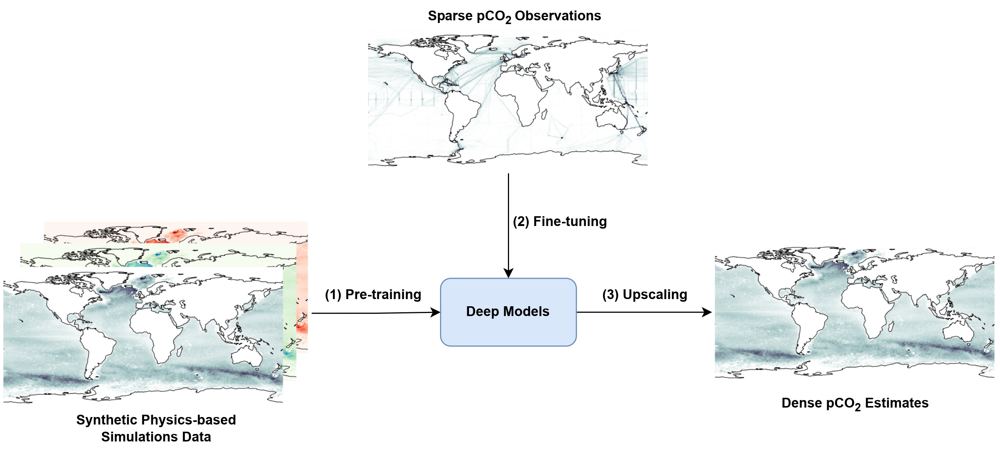

Spatiotemporal upscaling of sparse air-sea pCO2 data via physics-informed transfer learning
==============================

__Paper__: TBD (to appear in Scientific Data, Nature Publishing)

__Authors__ (\*: equal contribution): Shaun (Siyeon) Kim* [sk4973@columbia.edu](mailto:sk4973@columbia.edu), Juan Nathaniel* [jn2808@columbia.edu](mailto:jn2808@columbia.edu), Zhewen Hou, Tian Zheng, Pierre Gentine

__Dataset__: https://zenodo.org/records/12726686

__TLDR__: We leverage physics embedded in Earth System Models and sparse observations fine-tuning to derive global, long-term $pCO_2$ product (i.e., physics-informed transfer learning).



__Abstract__: Global measurements of ocean $pCO_2$ are critical to monitor and understand changes in the global carbon cycle. However, $pCO_2$ observations remain sparse as they are mostly collected on opportunistic ship tracks. Several approaches, especially based on direct learning, have been used to upscale and extrapolate sparse point data to dense estimates using globally available input features. However, these estimates tend to exhibit spatially heterogeneous performance. As a result, we propose a physics-informed transfer learning workflow to generate dense $pCO_2$ estimates that are grounded in real-world measurements and physically consistent. The models are initially trained on dense input predictors against $pCO_2$ estimates from Earth system model simulation, and then fine-tuned to sparse SOCAT observational data. Compared to the benchmark direct learning approach, our transfer learning framework shows major improvements of up to 56-92\%. Furthermore, we demonstrate that using models that explicitly account for spatiotemporal structures in the data yield better validation performances by 50-68\%. Our strategy thus presents a new monthly global $pCO_2$ estimate that spans for 35 years between 1982-2017.

<!-- ## CNN-UNET Pretrained Model

### PERFORMANCE


**RMSE over TIME** 


## ConvLSTM Pretrained Model 

### PERFORMANCE


**RMSE over TIME** 


## Performance compared to Traditional ML

| Model  | RMSE (uatm) |
| ------------- | ------------- |
| Random Forest  | 40.387 |
| FFN  | 39.494 |
| XgBoost  | 37.709  |
| **CNN-UNET**  | **8.499** |
| **ConvLSTM** | **3.737**  |


## Potenial Use Cases of Pretrained Models

1. Used to predict dpCO2 in addition to pCO2 via transfer learning
2. Used to predict pCO2 in real world SOCAT sampling via transfer learning -->

Getting Started
------------

### Requirements
This model was trained on the following libraries:

```` 
cuda11.0/toolkit cuda11.0/blas cudnn8.0-cuda11.
tensorflow==2.4.0
````

### Downloading Data and Libraries
To download the data from [figshare](https://figshare.com/articles/dataset/CESM_ocean_pCO2_testbed/8798999?file=16129505):
```` 
mkdir data #create data directory
./download_data.sh [file_id]
````
    - file_id : 8 code digit at the end of the data url from figshare


To download the python libraries:
```` 
pip install -r requirements.txt
````


Project Organization
------------
    ├── LICENSE
    ├── Makefile           <- Makefile with commands like `make data` or `make train`(coming soon!)
    ├── requirements.txt   <- The requirements file for reproducing the analysis environment, e.g.
    │                         generated with `pip freeze > requirements.txt
    │
    ├── download_data.sh   <- .sh to download figshare ocean_pco2 data
    ├── README.md          <- The top-level README for developers using this project.
    │    │
    ├── models             <- Trained and serialized models
    │
    ├── notebooks          <- Jupyter notebooks. Consists of EDA and Base Model implementations.
    │
    ├── assets             <- Visualizations (gif, png, etc. )created for the project
    │
    ├── src                <- Source code for use in this project.
    │   ├── __init__.py    <- Makes src a Python module
    │   ├── utils.py       <- various util functions for data preprocessing and plotting
    │   │
    │   ├── features       <- Scripts to turn raw data into features for modeling
    │   │   └── build_features.py
    │   │
    │   ├── models         <- Scripts to train models and then use trained models to make
    │   │   │                 predictions
    │   │   ├── predict_model.py
    │   │   └── train_model.py
    │   └── 
    └── 
--------

<p><small>Project based on the <a target="_blank" href="https://drivendata.github.io/cookiecutter-data-science/">cookiecutter data science project template</a>.
